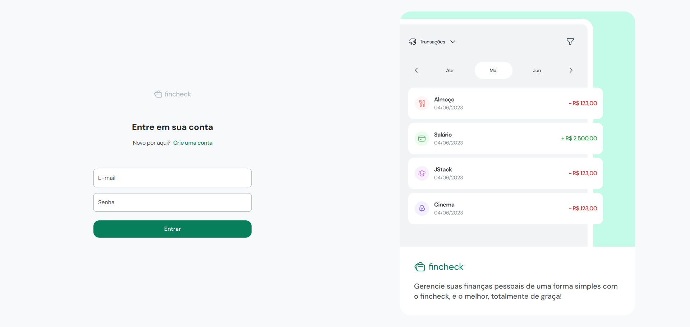
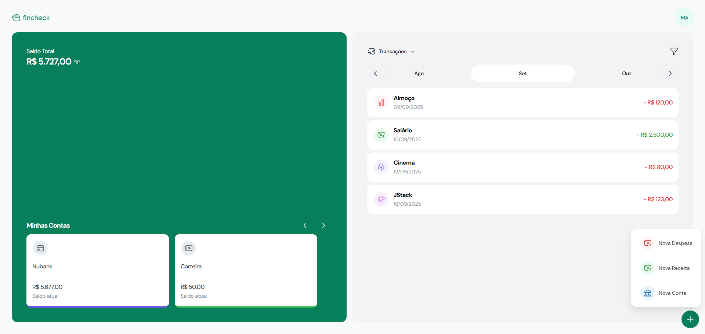

# Fincheck (Frontend)

Frontend for Fincheck, a project to help users manage their finances.

For more details on other project components, check out the API and mobile client repositories.

## Technologies

These are some of the technologies used in this project:

- `react`, `react-dom`: Core libraries for building user interfaces.
- `vite`: Fast frontend build tool and development server.
- `typescript`: Strongly typed programming language that builds on JavaScript.
- `tailwindcss`, `@tailwindcss/vite`, `tailwind-merge`: Utility-first CSS framework and related tools for styling.
- `@tanstack/react-query`, `@tanstack/react-query-devtools`: Data fetching and caching for React.
- `react-hook-form`, `@hookform/resolvers`: Form management and validation.
- `zod`: TypeScript-first schema validation.
- `axios`: Promise-based HTTP client.
- `date-fns`: Modern JavaScript date utility library.
- `@radix-ui/react-*`: Accessible UI primitives for React.
- `react-hot-toast`: Toast notifications for React.
- `react-day-picker`: Date picker component for React.
- `swiper`: Modern mobile touch slider.
- `eslint`: Linting tool for JavaScript/TypeScript code.
- `clsx`: Utility for constructing `className` strings conditionally.

_For more information about other dependencies, see the `package.json` file._

## Prerequisites

Before installing and running this project, make sure you have the following:

- **Node.js**: Install Node.js from [nodejs.org](https://nodejs.org/).
- **Package Manager**: You need a package manager for Node.js. This tutorial uses [pnpm](https://pnpm.io/), but you can use npm or yarn if you prefer.

## Installation

1. Clone the repository:

   ```bash
   git clone https://github.com/matheuscruzhen/fincheck-fe.git
   ```

2. Browse to the project folder:

   ```bash
   cd fincheck/fe
   ```

3. Install dependencies:

   ```bash
   pnpm install
   ```

4. Create a `.env` file in the root of the project and set the environment variables as described below (if needed):

   ```bash
   # VITE_API_URL: The base URL for the Fincheck API.
   VITE_API_URL="http://localhost:3000"
   ```

## Available scripts

This section describes the available scripts in the `package.json` file and their functionalities.

### Development

- #### `dev`

  Starts the frontend development server with live-reloading.

  ```bash
  pnpm dev
  ```

### Production

- #### `build`

  Compiles the application for production.

  ```bash
  pnpm build
  ```

- #### `preview`

  Previews the production build locally.

  ```bash
  pnpm preview
  ```

### Linting

- #### `lint`

  Runs ESLint to check for code quality issues.

  ```bash
  pnpm lint
  ```

## Print Screens

Below are some print screens from the Fincheck web app:




## Related links

- [React](https://react.dev/)
- [Vite](https://vitejs.dev/)
- [Tailwind CSS](https://tailwindcss.com/)
- [TanStack Query](https://tanstack.com/query/latest)
- [Radix UI](https://www.radix-ui.com/)

## License

[UNLICENSED](LICENSE)
